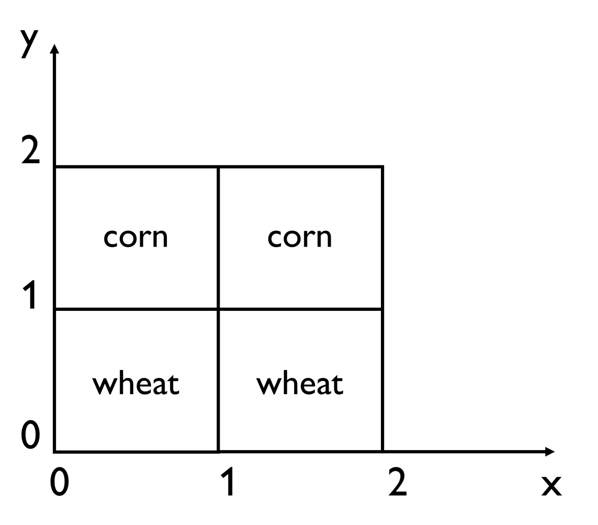

# Discover and Manage Farms

## Motivating scenario

A farm is separated to 4 land sections: The first two land sections grow crops of type wheat, and they are of square shape of length 1, characterised by their opposite corners at point coordinates [0,0],[1,1] and [1,0],[2,1] respectively. The other two land sections grow crops of type corn, and they are of square shape of length 1, characterised by their opposite corners at point coordinates [0,1],[1,2] and [1,1],[2,2] respectively.  

Each crop type has a required moisture level: Once the moisture level of crops falls under the required one, the crops should be irrigated.  The required moisture levels of wheat and corn are 120 and 80, respectively. 

The farm contains two tractors that can be controlled within the coordinates of the farm’s land sections: One tractor offers an action affordance for reading the current moisture level of the farms’ land sections, and one tractor offers an action affordance for irrigating the farm’s land sections.  

The tractors are operated by two autonomous agents: An agent that monitors the current moisture levels of land sections, and an agent that irrigates land sections.

## Informal competency questions

| ID | Question in Natural Language                                                                      | Example                                                                                                                      |
|----|---------------------------------------------------------------------------------------------------|------------------------------------------------------------------------------------------------------------------------------|
| q1 | What are the tractors in farm X? | Tractors contained in farm `ex:farm`: `ex:tractor1`, `ex:tractor2`.
| q2 | What is the W3C WoT Thing Description of a tractor in farm X that offers an affordance for reading the moisture level of soil?| Thing Description of a tractor contained in farm `ex:farm`: [<https://raw.githubusercontent.com/Interactions-HSG/example-tds/was/tds/tractor1.ttl>](https://raw.githubusercontent.com/Interactions-HSG/example-tds/was/tds/tractor1.ttl).|
| q3 | What is a tractor in farm X that offers an affordance for irrigating the soil? | Thing Description of a tractor contained in farm `ex:farm`: [<https://raw.githubusercontent.com/Interactions-HSG/example-tds/was/tds/tractor1.tt2>](https://raw.githubusercontent.com/Interactions-HSG/example-tds/was/tds/tractor2.ttl).|
| q4 | What are the land sections in farm X? |  Land sections of farm `ex:farm`: `ex:section1`, `ex:section2`, `ex:section3`, `ex:section4`|
| q5 | What are the coordinates X1, Y1, X2, Y2 that define land section X? | Coordinates of land section `ex:section1`: `0`, `0`, `1`, `1`, respectively.|
| q6 | What is the crop growing in land section X? |  Crop growing in land section `ex:section1`: `ex:crop1`.|
| q7 | What is the required moisture level of crop X based on its crop type? | Required moisture level of `ex:crop1`: 120.|

## Glossary of terms
- **Farm**: A plot of land devoted to the growing of crops.
- **Tractor**: An automotive vehicle that offers affordances to agents for managing a farm.
- **ReadSoilMoistureAffordance**: An affordance offerred by the environment to agents for reading the moisture level of soil.
- **IrrigateAffordance**: An affordance offerred by the environment to agents for irrigating the soil.
- **Coordinates**: A set of 4 coordinates [X1,Y1,X2,Y2] that define the opposite corners of a square section at points [X1,Y1] and [X2,Y2].
- **SoilMoisture**: The level of moisture in soil.
- **Section**: Land sections that divide the farm, consisting of different crop types. The type of land section is square.
- **Crop**: Crop grows on land sections.
- **WheatCrop**: One kind of crop type grew on the land sections.
- **CornCrop**: Another kind of crop type grew on the land sections.
- **Agent**: Agent operates the tractor.
- **MonitorAgent**: Agent that operates the tractor to monitor the level of moisture of the land section.
- **IrrigateAgent**: Agent that operates the tractor to irrigate the land section.
- **hasLandSection**: The farm has land sections.
- **hasDimension**: The geometric information of the land section defined by the coordinates.
- **grows**: The land section grows crops, such as wheat and corn.
- **hasMoistureLevelOf**: The land section has moisture level.
- **contains**: The farm contains tractors.
- **operates**: The agent operates a tractor.
- **hasActionAffordance**: The tractor has an affordance for a land section.
- **monitors**: The capacity of an affordance to read the moisture level of soil of a land section.
- **irrigates**: The capacity of an affordance to irrigate a land section.

